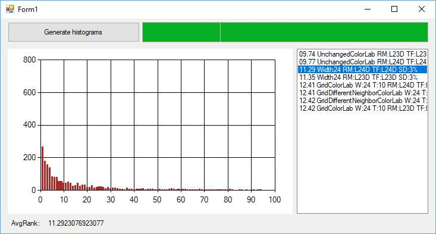
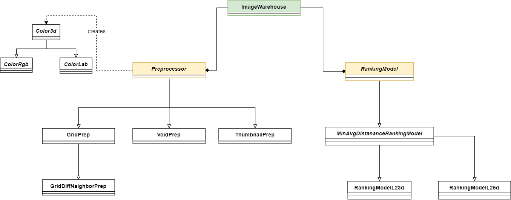

# Dokumentácia k programu 

## Motivácia
Jeden zo spôsobov vyhľadávania vo videu je kreslenie jednoduchých farebných skíc. Užívateľovi je zobrazené plátno na ktoré má možnosť umiestniť 3 až 5 farebných krúžkov. Tento nákres je následne porovnaný so snímkami vo videách a snímky sú zoradené podľa podobnosti nákresu. Algoritmus, ktorý vyhodnocuje podobnosť nákresu a snímku videa nazývame *ranking model*.

Vstupom ranking modelu je nákres a sada obrázkov, ktorú má zoradiť. Výstupom je zoradený zoznam obrázkov podľa podobnosti k nákresu.

Cieľom tohto programu je umožniť porovnať rôzne ranking modely.

## Porovnanie ranking modelov
Máme k dispozícii dataset 2500 nákresov o ktorých vieme ku ktorým obrázkom patria. Ide o nákresy k 100 obrázkom.

Každý z 2500 nákresov využijeme ako vstup pre ranking model. Ranking model nám vráti zoradených 100 obrázkov podľa blízkosti k nákresu.

Vo výsledkoch zistíme pozíciu obrázka, ktorý patril k nákresu na vstupe. Priemerná pozícia vo výsledkoch vyhľadávania je hodnotenie kvality algoritmu.

## Užívateľské rozhranie

Po spustení programu sa zobrazí rozhranie.
Po kliknutím na tlačítko "Generate histograms" sa spustí hodnotenie algoritmu a priebeh sa bude zobrazovať v progress bare napravo od tlačítka.

Po skončení výpočtu sa v pravej časti zobrazí zoznam výsledkov s hodnotením algoritmu.
Po kliknutí na konkrétny výsledok sa naľavo zobrazí histogram - na ose X pozícia obrázku vo vyhľadávaní a na ose Y počet obrázkov, ktoré skončili na tejto pozící.



# Architektúra programu

UML diagram kľúčových tried:




## Možnosti

Ranking model sa skladá z dvoch častí:
- preprocessing
- ranking

Preprocessing aktuálne pozostáva zo zmenšenia obrázku.
K dispozícií sú tieto algoritmy:
- bikubické (trieda `ThumbnailPrep`)
- preloženie mriežkou (trieda `GridPrep`)
- preloženie mriežkou s odlišnými susedmi (trieda `GridDifferentNeighborPrep`)
- bez zmenšenia (trieda `VoidPrep`)

Na ranking sú k dispozící tieto algoritmy:
- `L23dRankingModel` - vzdialenosť farby v 3D farebnom priestore
- `L24dRankingModel` - vzdialenosť farby v 3D farebnom priestore + vzdialenosť cieľového pixelu od krúžku
- `L25dRankingModel` - vzdialenosť farby v 3D farebnom priestore + vzdialenosť cieľového pixelu od krúžku v X a Y
- `L2idfRankingModel` - vzdialenosť s využitím inverse document frequency

Algoritmy navyše dostávajú tieto parametre:
- farebný priestor, v ktorom má byť vyhodnocovaná vzdialenosť farieb: RGB (trieda `ColorRgb`), Lab (trieda `ColorLab`)
- algoritmus na zisťovanie cieľového pixelu (`TargetFinder3d`, `TargetFinder4d`, `TargetFinder5d` obdobne ako u ranking modelov)

Tieto možnosti sa dajú nastaviť upravením užívateľského kódu v metóde `imageWarehouseFactory()` v súbore `Program.cs`.

```
static unsafe ImageWarehouse imageWarehouseFactory(string sourceDir)
{
    var iw = new ImageWarehouse(sourceDir, DbConn);

    iw.Preprocessors.Add(new GridPrep<ColorLab>(24, 10));
    iw.Preprocessors.Add(new ThumbnailPrep<ColorLab>(24));
    iw.Preprocessors.Add(new VoidPrep<ColorLab>());
    iw.Preprocessors.Add(new GridDifferentNeighborPrep<ColorLab>(24, 10));

    iw.RankingModels.Add(new L23dRankingModel<ColorLab>(new TargetFinderL23d(3, 0)));
    iw.RankingModels.Add(new L24dRankingModel<ColorLab>(new TargetFinderL24d(3, 0)));

    return iw;
}
```
